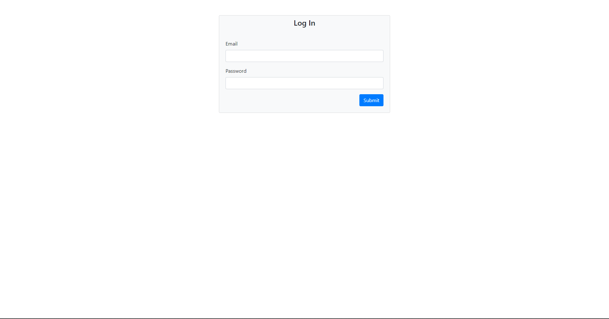
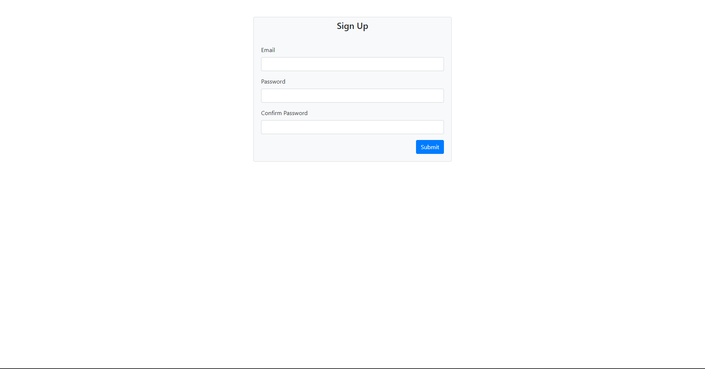
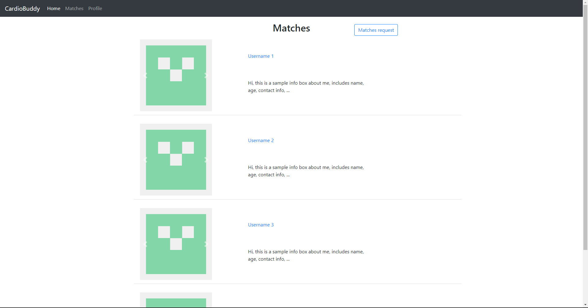
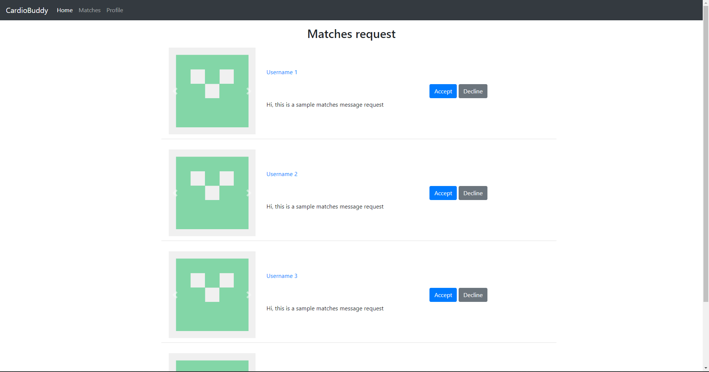

## Login/Signup

User upon arriving at out site would be required to login or signup in order to continue using the application.

## Matches

This page would consist of all matches/connections of a user

This page would consist of all matches/connections request of a user

