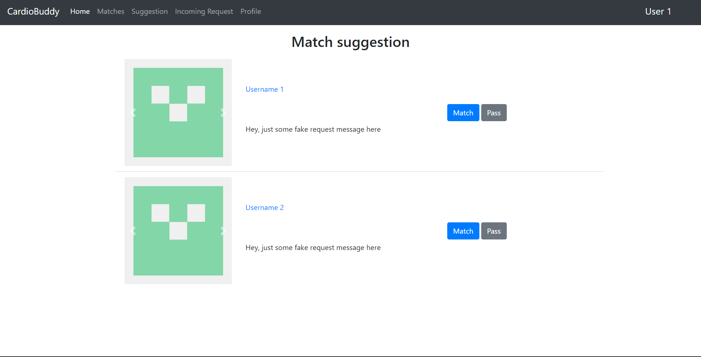
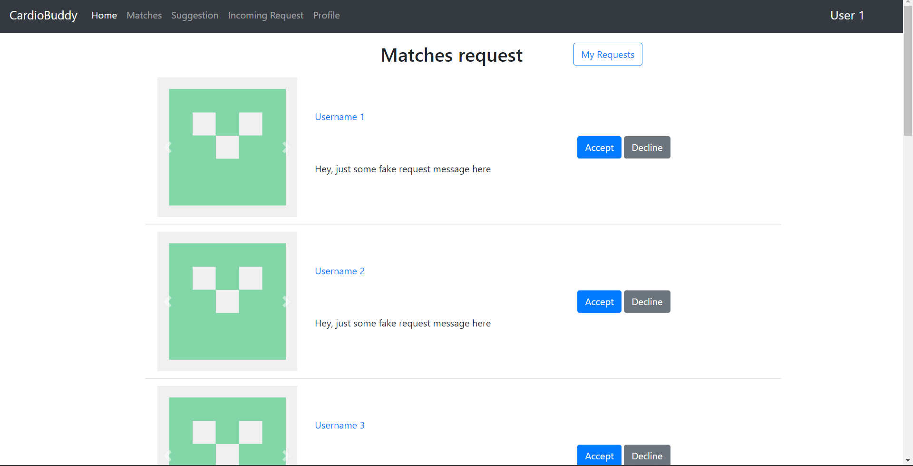
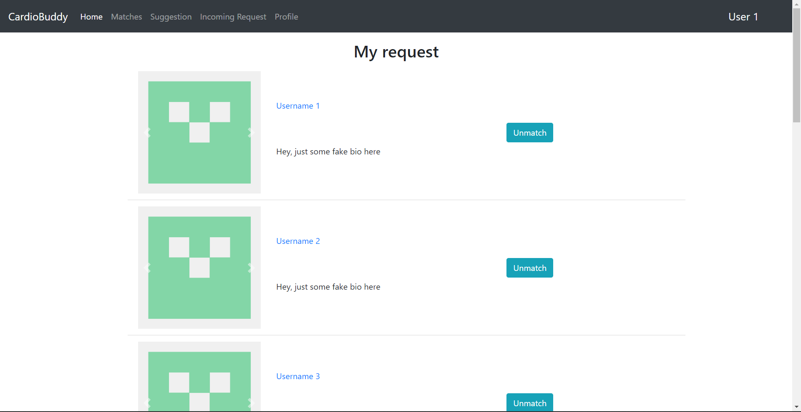
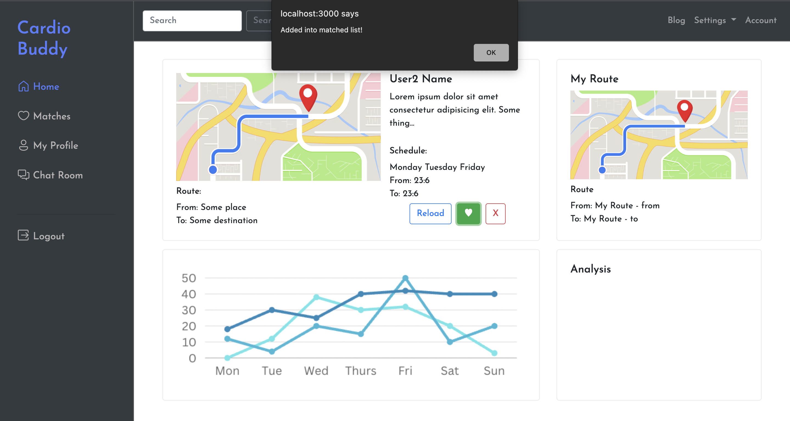
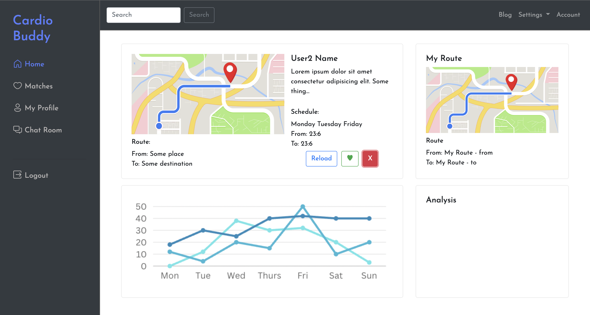
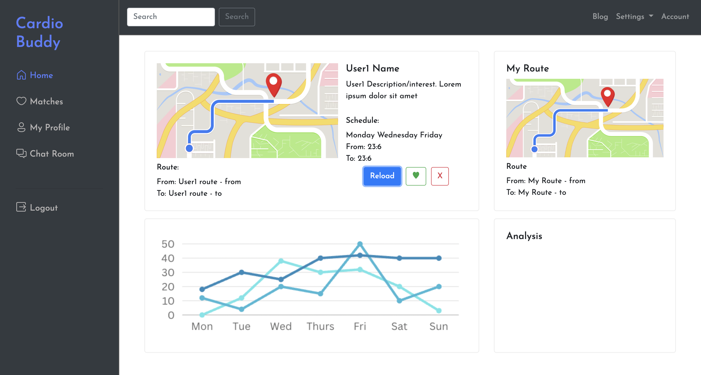
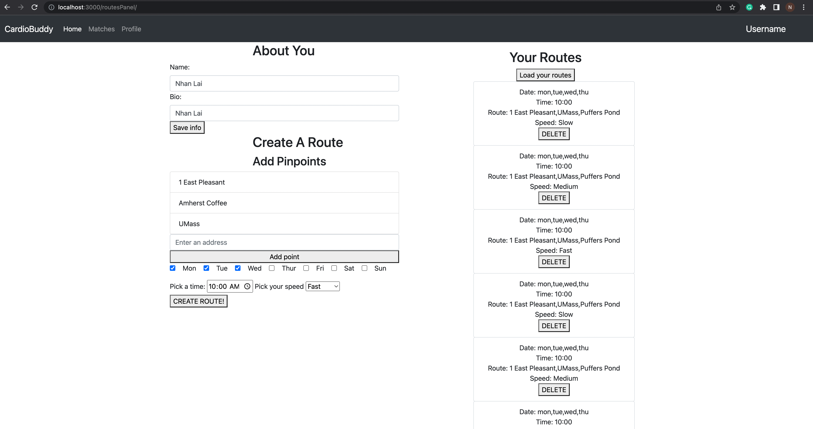

# Heroku
https://cardio-buddy.herokuapp.com/home

# Part 0, Backend API planning

### User CRUD

-   GET /api/users/:userId : Get the user information
-   POST /api/users : Create and register a new user
-   UPDATE /api/users/:userId : Update user information
-   DELETE /api/users/:userId : Delete the user
-   POST /api/users/login : Login the user

### Match CRUD

-   GET /api/request : Get all the match requests for a user
-   GET /api/request/:requestId : Get the specific match request with the given id
-   POST /api/request : Create/Request a match request from the current/logged-in user to another user
-   UPDATE /api/request : The receiver accept/decline the match request with the given id
-   DELETE /api/request : The request sender delete the match request with the given id
-   GET /api/users/:userId/match : Get the list of users that has matched with the user with the specified id
-   GET /api/users/:userId/request : Get the list of request that was sent by the user
-   POST /api/request/suggestion : Get a list of suggestion with information specified in the request body
-   POST /api/users/search : Search for users with the specified info in the request body

### Path CRUD

-   GET /api/paths/:pathId : get any path by its id
-   GET /api/paths/:userId : get a user's path
-   POST /api/paths/ : create a new path
-   UPDATE /api/paths/:pathId : update a path's data
-   DELETE /api/paths/:pathId : delete a path with its id

# Part 2, Frontend Implementation

When user press match, it will trigger a Create operation that create a new match request

When user accept or decline a match request, an Update operation will be triggered and update the status of the specific match request.

When the user hit unmatch, the specified match request will be delete from the database.

All of the above page has Read operation to fetch the data to display for the user.

When user click '♥', the information of the liked user will get sent to the database and check if it is a match. Alert will be triggered to notify user that they clicked 'like'. The new suggested user will be rendered on the match deck.

When the user click 'X', the current rejected user will be removed from the deck and the new new suggested user will be rendered on the match deck.

When the user click 'Reload', the match deck will be refreshed. The new suggestion list is fetched and rendered.

https://cardio-buddy.herokuapp.com/routesPanel

When user updates their profile and hit the "Save Info" button, their info in the database would be updated using PUT

When user click "CREATE ROUTE", a new route would be created in the database (POST)

Users can view their routes by clicking "Load your routes" (GET)

Users can delete any route they created using the "DELETE" button (DELETE)

# Work distributions

users, requests backend api (include routing, mongo models still in progress) - Bang Cao

match, request, suggestion, userRequest page (include routing) - Bang Cao

paths backend api (routing and mongo models in progress) - Nhan Lai

creating paths, adding pinpoints in paths, showing all paths, updating user info in frontend (routing and API calling) - Nhan Lai

heorku deployment - Nhan Lai

home routes, homepage (render suggested cardio buddies and user map/information) - Vi Doan

getSuggestions and users backend api (modified and constructed a sample api) - Vi Doan

redirect matches page, my profile page, chat page, logout page from home page - Vi Doan